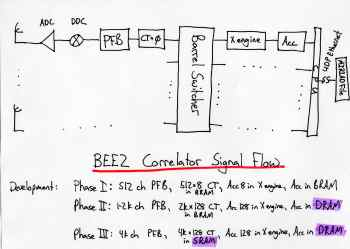

Plans for an 8-station, Dual-Polarization Correlator on the BEE2
================================================================

### Background

This document is a status report, updated 7/29/05, on the development of
an 8-station correlator using BWRC's BEE2 architecture (which includes
the BEE2, iBOB, and iBOB-ADC board). Both the BEE2 and iBOB are powered
by Xilinx Virtex 2-Pro FPGAs. Designs for these FPGAs are being
constructed using the Matlab/Simulink/System Generator toolset. The
latest revision of all simulink libraries are available
[here](https://github.com/casper-astro/mlib_devel/). These
libraries include designs for a biplex-pipelined FFT, an FIR front-end
for implementing Polyphase Filter Banks, frequency-domain
cross-multiplication (X engines), and matrix transpositions in BRAM and
DRAM.\
\
]\
Above is our current architecture for cross-correlating radio antennas.
We are currently in the process of implementing an 8-station correlator
that will be a useful stepping-stone for the development of the [Allen
Telescope Array](https://www.seti.org/ata) and for Don
Backer's EoR Array in Greenbank. A parameterized X-engine has been
implemented based on a pipelined architecture designed by Lynn Urry.

### Phase I
]\
In order to speed development, this architecture is initially going to
be implemented, as diagrammed above, using on-FPGA resources
exclusively. This first implementation, PHASE 1, limits the size of the
correlator to the number of results which can be stored in BRAM in the
final accumulators. For full-Stokes accumulation, the size of this
accumulator must solve the equation:

**(PFB channels) \* (Antennas)\^2/2 \* (8 real numbers for full Stokes)
\* (4 Bytes per number) = (384 \* 18 kb BRAM storage per FPGA)**

For 8 antennas, this comes to 512 channels.

### Phase II

We will overcome this limitation in PHASE 2, where we move this
accumulator into off-FPGA DRAM. This will allow us to raise the number
of channels in the PFB to 1k. The limiting factor in this design becomes
the corner-turn following the PFB. In order to lower the data rate to
the bandwidth of DRAM (which is about 4 GB/s for sustained bidirectional
data flow), we will have increase the accumulation which occurs in the
X-engine to sum 128 results before dumping to the accumulator. Since 2
dual-polarization PFBs need to be transposed, with each polarization
represented by a 4-bit real/4-bit imaginary complex number, the equation
for the size of this corner-turn is:

**(PFB channels) \* (2 Antennas) \* (2 Polarizations) \* (8 bits per
complex number) \* (128 Accumulation Length) = (384 \* 18 kb BRAM
storage per FPGA)**

This limits PFB channels to 1k.

### Phase III

This final limitation will be overcome by moving the PFBs into the iBOB,
allowing for the corner-turn to be implemented in on-board SRAM. This
effectively removes the channel limitation of the correlator. SRAM is
easy to use, and FPGA controllers for it will be available well in
advance of those for DRAM. However, moving the PFB into the iBOB
requires the synchronization of multiple iBOBs to one another, which
will involve a rewrite of the XAUI 10 Gb controllers that handle
communication between boards.
