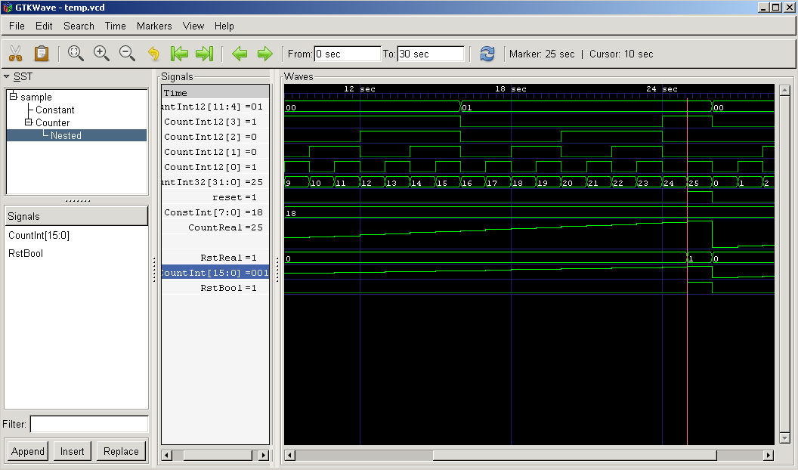
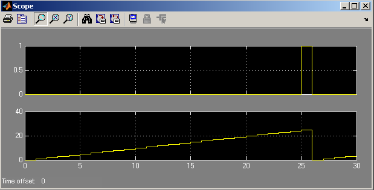

# Gtk Wave Capture
## Description ##
This library provides blocks which capture data from the Simulink environment. The captured data is then parsed to create a [VCD](http://en.wikipedia.org/wiki/Value_Change_Dump) file which is then passed into the [gtkWave](http://gtkwave.sourceforge.net) waveform viewer.

## Installation ##

1. Download and install gtkWave for Windows [here](http://www.dspia.com/gtkwave.html)
2. Add gtkWave directory to system PATH. Restart MATLAB to ensure it sees the new path. (Not strictly necessary)
3. The gtkWaveCapture library is contained in the GAVRT libraries located [here](https://casper.ssl.berkeley.edu/svn/trunk/caltech/lib/)

## Old instructions (for reference) ##
1. Download gtkWave.mdl library and associated files: [gtkWave_lib.pdf](Gtk_wave_capture_files/gtkWave_lib.pdf) (Rename to .zip)
2. Open **sample.mdl** and run the simulation. Double click **gtk_parse** block to view result in gtkWave.

## Updates ##

* **Mar. 27, 2008** Workaround for MATLAB 63 character limit on variable names. Now uses hashcode.m to make a short unique variable name. hashcode.m is part of the CASPER DSP libraries, but a copy has been included to make this package self sufficient.

## Usage ##

* Connect the Bool, Int, or Real blocks to Xilinx Fix signals to capture the simulation data. The signal will show up in gtkWave with the same name as the Bool, Int, or Real block. Thus the default Bool variable name would be 'gtkBoolVar'.
* Double clicking the 'gtk_parse' block will parse the captured data and create a VCD file and open it in gtkWave for viewing.
* Double clicking the 'gtk_view' block opens the previously created VCD file in gtkWave.
* In gtkWave, pressing 'File/Write Save File' or 'ctrl-S' will save the current viewing settings. These settings will be reloaded automatically the next time 'gtk_parse' or 'gtk_view' is run.

### Notes: ###
1. You must not name any variables with names starting 'gtk_'
2. By default, the signals in gtkWave are simply named after the block that captured them. If you create a variable in the workspace called 'full_path_gtk', the signals will be named with the full path heirarchy. This aids clarity, but takes up plotting real estate.

## Comparison to built-in scope ##

These screen shots illustrate the differences between gtkWave and the built-in Simulink scope.

### Pros: ###
* No need for multiple scopes. All data displayed against each other on the same timescale.
* Data values displayed directly on trace. No need to zoom on y axis to see if a register is 254 or 255, for example.
* Binary signals are much easier to read. Auto-scaling in Simulink shows transitions clearly, but makes absolute 0 or 1 distinction more difficult.
* Signals are all labeled. This is possible but quite difficult in Simulink.
* Cursor makes it easier to see all events at a specific time.
* Zooming is much easier. No need to autoscale between each zoom operation.
* Bits within integer signals can be regrouped. Thus if a signal is a concatenation of other signals, the constituent signals can be viewed with ease.

### Cons: ###
* Requires adding a block for each signal to be viewed. However, this is less trouble than getting signal names on the Simulink scope.
* Not well suited for displaying floating point signals. gtkWave lacks a y axis zoom.
* Currently limited to integers of 50 bits or less because the values are stored as doubles by MATLAB.
* Currently, the [VCD](http://en.wikipedia.org/wiki/Value_Change_Dump) file generated dumps the signal values at every clock, instead of only when the value changes.
* The intermediary VCD files can be very large.