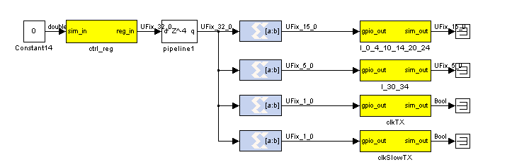
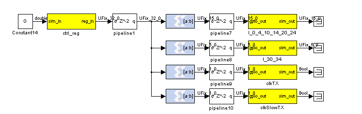

## Latency Memo: Maximum Useful Latency
### Overview ###
While adding latency is a good idea to improve timing of your designs, there is a limit to the useful amount of latency to use in each block. If additional latency is selected beyond the maximum amount listed here, the extra latency will be implemented as registers or SRL-16 resources in the FPGA and will not help meet timing requirements.

This information was extracted from the Xilinx documentation, in particular the Coregen documentation mostly. It has not been fully experimentally verified.

Don't forget to enable pipelining where possible, otherwise adding latency will not help

### Maximum Latency List ###

* **Cast/Convert** >3 doesn’t help
* **(Embedded) Multiplier** >3 unlikely to help for up to 18x18 multiplies if output precision is full. For saturation etc, not sure, additional might help.
* **BRAM** >3 unlikely to help
* **MUX** for less than 8 inputs, latency >1 unlikely to help
* **Add/Sub** No info. I’ve seen latency up to 6 help timing.

### Empirical Results ###

The following behaviors have been observed, and may be applied to trick the tools into giving better timing results. YMMV.

### Bit-sliced bus pipelining ###

Under **10.1**, pipelining a bit-sliced bus after the slicing gave better timing results, even with the same total latency.

The following implementation **did not** meet a 350MHz time constraint on ROACH with SX95T-1:

The following (supposedly equivalent) implementation **did** meet the same timing constraint:

