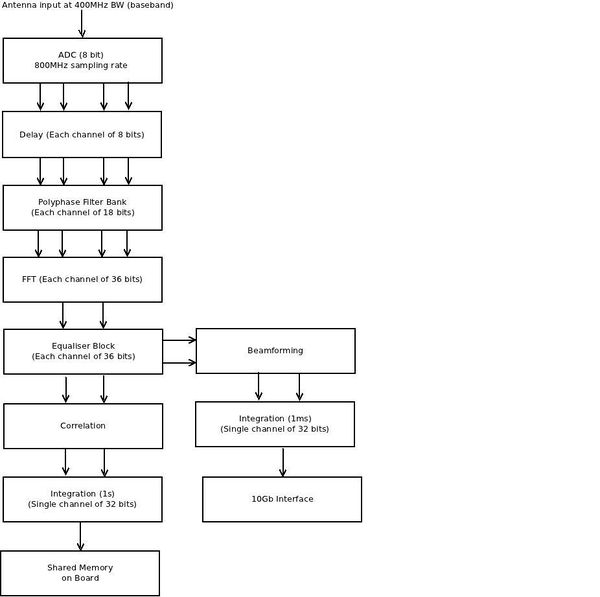
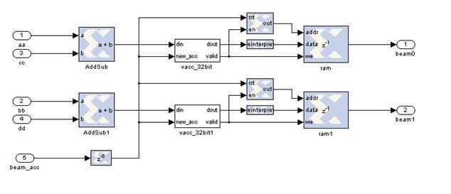
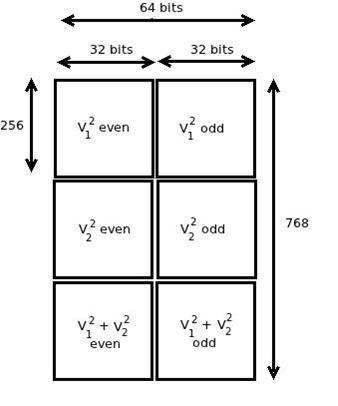
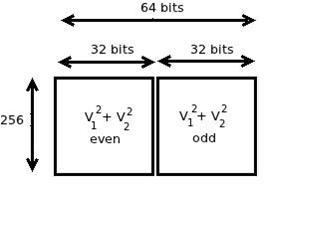
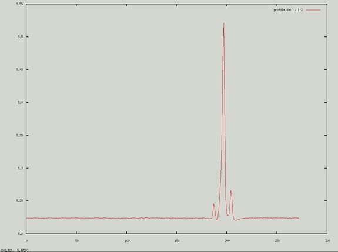
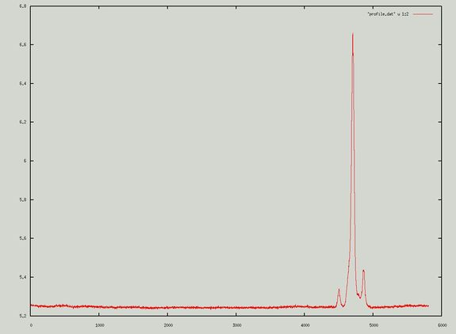
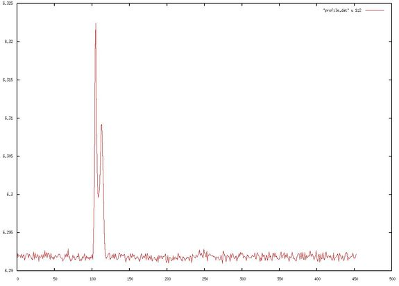
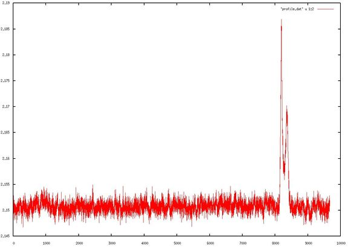

# Pocket Beamformer(PoBe) on FPGA

This project was carried out as a part of the summer project by Cambodge Bist, under the guidance of Kaushal Buch, Ajithkumar B. and Prof. Yashwant Gupta at the Giant Metrewave Radio Telescope, National Centre for Radio Astrophysics, TIFR, India.

## Introduction

The Pocket Beamformer (PoBe) is an FPGA based digital design that implements the incoherent beamforming algorithm for 2 antennas. The PoBe is an extension to the Pocket Correlator (PoCo) which is a 2 antenna correlator. The PoBe works at a bandwidth of 300 MHz on the ROACH board. This memo explains the PoBe digital design in terms of modification of PoCo, and the implementation of incoherent beamforming algorithm. It demonstrates the use of a 10Gbps network link for faster integration as required by beamformers. This memo also describes depacketisation and offline data processing. Results of sky tests performed with the PoBe are also provided.

## Incoherent Beamforming

A two antenna incoherent beamforming can be mathematically described as the addition of total intensity from two antennas.

B = ∑ (V12 + V22)

## Design Approach

The approach is to design the beamformer using the existing Pocket Correlator (PoCo) [Pocket Correlator](../../Projects/files/Pocket_correlator.md) design. The two antenna PoCo design generates 4 outputs- self power spectra of antenna 1, self power spectra of antenna 2, the cross amplitude power spectra and cross phase spectra of both the antennas. The concept behind the Pocket Beamformer (PoBe) is to tap certain outputs from the PoCo system and use them as inputs for the beamformer design. The challenge in the PoBe design is to integrate it at millisecond rate and packetize the beamformed output (for data acquisition in PC). The data packets are transmitted from Roach to PC via a 10GbE link. The packets are captured by an open source packet grabbing utility called GULP. For offline post-processing, a `C' program is developed to make the data compatible for the software used for de-dispersion and fast folding.

## Digital Design in System Generator

As mentioned previously, the PoBe design is an extension to the PoCo digital system. The concept is to tap required outputs from PoCo and then process the beamforming algorithm. The diagram below shows the PoCo design chain (left) and the PoBe design chain (right).

The mathematical expression for two antenna incoherent beamforming is: 

Bi = ∑ (V12 + V22)

Similar logic is implemented on the ROACH. This is seen in the diagram below.

The following list defines each annotation:
*	‘aa’ is channel V12 (even)
*	‘cc’ is channel V22 (even)
*	‘bb’ is channel V12 (odd)
*	‘dd’ is channel V22 (odd)
*	beam acc is the synchronising clock particularly designed for the beamformer
*	beam0 is V12+ V22 (even)
*	beam1 is V12+ V22 (odd)

From the AddSub block it is seen that the addition of even channels and addition of odd channels is carried out separately. This output is then taken passed to the integration or accumulation block: vacc32bit. The integration block provides a 32 bit output with binary point after six bits; which is then reinterpreted into 32 bit with no binary point before sending it to the RAM. The RAM data is then packetized and sent to the PC via a 10G Ethernet cable after short time integration.

## Synchronisation Clock

Incoherent Beamforming is carried out by integrating the signal over a short time span. The synchronisation pulse of PoCo is generated once in every 227 clock cycles, which is equivalent to 219 FFT cycles. The result is an integration time of 0.89s for both PoCo and PoBe which is large compared to the requirement of pulsar beamformers.

Hence, a new PoBe synchronization pulse is designed (as an integral sub-multiple of) the PoCo (synchronizing) pulse. This allows the PoBe design to work from the PoCo synchronization pulse and its integration time can be set independently through a configuration register which is modified using a python script. The lowest possible PoBe integration time is 3.41 us (theoretical). 

## Packetization

Packetization is required to assemble the data and transmit at faster rates over a 10 GbE. Before packetizing data for faster integration, it is necessary to packetize in such a way that we can also verify the functionality of the beamforming algorithm. The initial test packet was used to test the incoherent beamformer. Thus, the packet consists of V12, V22 and V12+ V22. Its design is as follows:

From the packet dimensions, it can be calculated that the packet size is 64 x 768 = 49152 bits or 6144 bytes (32-bits per spectral channel). 

•	A 6K packet at 7ms at 7.02 Mbps (experimentally verified)
•	A 2K packet at 1.75ms at 9.36 Mbps (experimentally verified) 
•	A 2K packet at 3.41us at 4.8 Gbps (theoretical)

However, the design can be optimized further, as V12 and V22, individually, are not needed for beamforming. Hence, the following design has been implemented:

The advantage of smaller packet is the reduced integration time due to reduced data size. Moreover, it saves resources on the FPGA and also makes de-packetization easier.

## Post Processing

### Packet Capturing

Packet Capturing is implemented by capturing data from a computer network. The standard packet analyser tool, [Wireshark](http://www.wireshark.org/), has been used to verify the transfer of packets. This software provides information such as the rate of data transfer per packet (integration time) and the packet size along with various other attributes of the packet as it passes along the network. However, the actual utility for packet capture is [GULP](http://staff.washington.edu/corey/gulp/). This open source software reads directly from the network interface and writes the data onto a disk. The packet capturing capability of GULP is dependent on the data rate.

Experimentally, the maximum data rate that GULP is able to sustain is 9.36 Mbps. Furthermore, if a 2K packet is sent through the 10G link at the lowest theoretical integration rate (3.41 us), the packet grabber needs to capture packets at the rate of 4.8Gbps. Thus, an alternate packet capturing utility is required for handling higher data rates.

### De-packetization

De-packetization is the process of de-segmenting the packet in order to make it compatible for further processing. This is carried out using a `C' program. This program has three features:
1.	Unpacking the data. A packet of size 6144 bytes is split into 3 packets of size 2048 bytes each. A packet of size 2048 remains unpacked.
2.	Converting the unsigned 32 bit (FPGA output) to 16 bit short int. This is required to meet the compatibility with the de-dispersion and fast folding software.
3.	Allows user to scale the data. This is required for ensuring compatibility with the de-dispersion and fast folding software.

### De-dispersion and Folding

The de-dispersion algorithm is used to account for the group delay caused by the interstellar medium while the fast folding technique requires collapsing the pulses in time series to obtain the pulsar peak well above the noise floor. The final step of the offline processing is to enter the data in software, which performs these algorithms on the beamformed output.

## Conclusion and Evaluation

### Results

1. The plots below show the Pulsar Profile of the PoBe in comparison to the GSB (existing 32 MHz GMRT Software Back-end) for B0329+54:

2. The plots below show the Pulsar Profile of the PoBe in comparison to the GSB for B1133+16:

### Conclusion

A Pocket Beamformer (PoBe) has been implemented as an extension to the PoCo, for a bandwidth of 300 MHz. The overall design has been verified by producing profiles of pulsars that match with the expected profiles measured with GMRT software backend (GSB). The PoBe design can be used along side the Pocket Correlator.