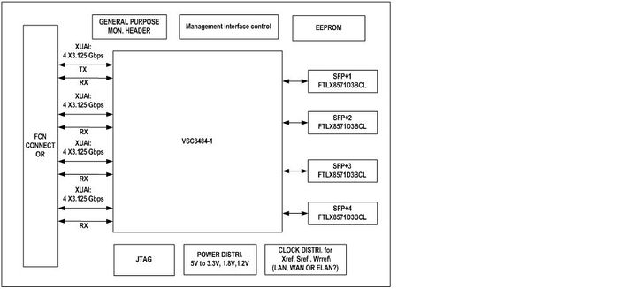
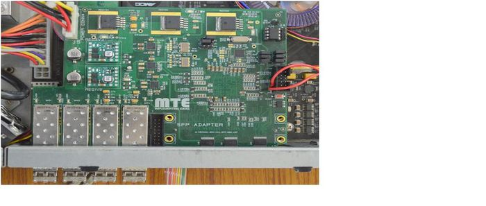
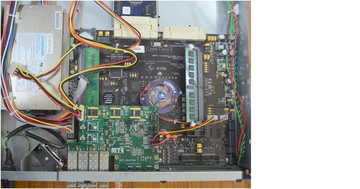

# SFP+ adapter for ROACH-1 board

Note: ROACH board mentioned throughout the document refers to ROACH-1 board.

## Introduction

ROACH board is equipped with four CX4 connectors. Each connector receives four lanes from ROACH board FPGA (Virtex-5). Each lane is capable of 3.125 Gbps data transfer.  The data over these four lanes can be combined and transmit through a 10 GbE link. The widely accepted standard for 10GbE data transfer over copper or fiber is the SFP+ (Small Form-Factor Pluggable). As the industry moves toward the SFP+ standard, large port switches with the CX4 connectors is getting obsolete. For a ROACH based packetized digital backend system, to process data from an array of antennas, an adapter board capable of converting CX4 standard to SFP+ standard is therefore necessary.

Giant Metrewave Radio Telescope’s (NCRA-TIFR, India) digital back end team and Mechatronics Test Equipments (I) Ltd., Pune, India, have designed, developed, and tested two prototype boards of SFP+ adapter interfacing with ROACH board.

## Design

The primary function of the adapter board is to serialize data over four lanes at a speed of 3.125 Gbps each into a single 10Gbps lane. For this purpose the XAUI to SFP+ transceiver PHY chip from Vitesse VSC8484 is selected. It is a quad PHY which can handle four parallel 10GbE channels. As there are four ports available on daughterboard interface connector (Fujitsu connector) on ROACH, we develop a daughterboard which interface these four ports to the four channels of PHY chip, Vitesse VSC8484.

The block diagram of the adapter module is as shown below –

PHY chip on the adapter board requires low jitter clock oscillator, regulated power supply, EEPROM and reset control circuit for its functioning. The EEPROM has to be programmed using the hex file available from the vendor.  The board also needs header connectors for I2C, MDIO and GPIO interfaces.

Note:  There is a mismatch between the schematics and the actual routing on the ROACH PCB. Currently, a change has been made in the xaui_infrastructure.v file to swap the lanes for the adapter board, to correct for the mismatch.  The modified  xaui_infrastructure.v  file and the corresponding system.ucf file are available at -

[xaui_infrastructure.v](SFP+_adapter_for_roach_files/xaui_infrastructure.v)

[system.ucf](SFP+_adapter_for_roach_files/system.ucf)

## PCB details

The card is developed using CADSTAR design tool. The eight layers of board are divided into power and signals considering the signal integrity.

## Power Consumption

Approximate power consumption of the board is around 13 Watts. The board is powered from the ROACH SMPS.

## Testing

A thorough testing of two prototype adapter boards was carried out on the ROACH board.
The following data transfer tests were carried out successfully as a part of the acceptance testing.

1. 10GbE loopback test within the ROACH board (Port 0 -> 1, 2 -> 3, 0 -> 3 etc.)

2. 10GbE between the ROACH boards

3. ROACH board to P.C. (with SFP+ NIC)

4. Loopback and board to board via SFP+ switch

Note: Each test was carried out for all the four ports.

## Conclusion

ROACH board equipped with SFP+ adapter can be used to design digital back-ends, as SFP+ becomes a popular standard for 10GbE data transfer. During the testing of this board, it was found that Fujitsu differential connector on the ROACH board is delicate and may get damaged if the mounting of the adapter board is not proper. Also, it was found that data streaming using XAUI blocks available in CASPER library does not work with the adapter.  Currently, GMRT and MTE are in the process of developing a standalone CX4 to SFP+ conversion unit for long term use with the ROACH boards.

For any other technical queries, please email:

Kaushal Buch 		(kdbuch@gmrt.ncra.tifr.res.in)  

Bhupesh Patil  		(bhupeshpatil@mte-india.com)

For pricing or purchase related queries, please email:  

mtepl@vsnl.net ; purchase@bitmapper.com 

