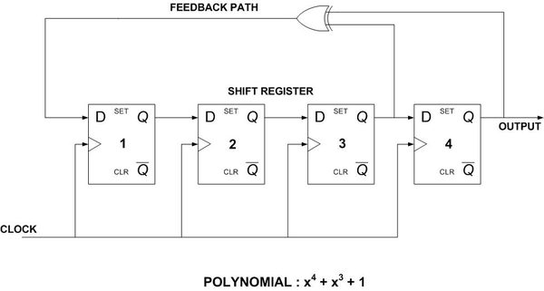
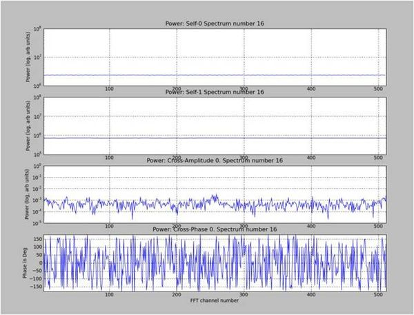
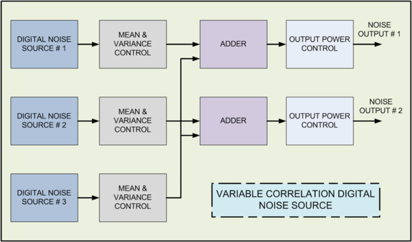
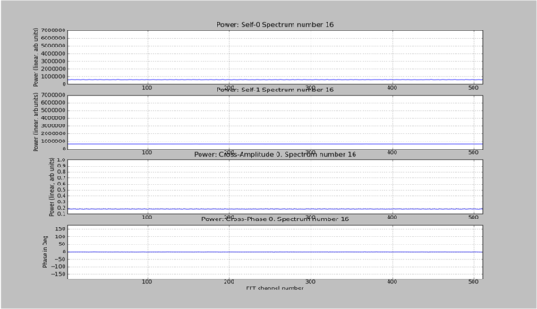
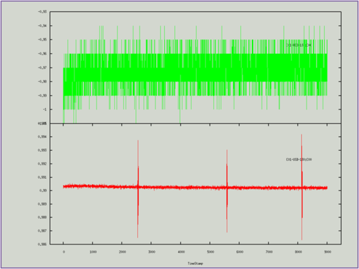
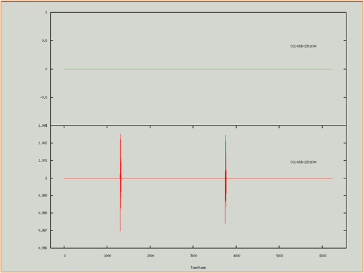

# Variable Correlation Digital Noise Source for FPGA

Kaushal D. Buch, Digital Backend Group, Giant Metrewave Radio Telescope,National Centre for Radio Astrophysics, TIFR,  India.

## Introduction

A digital noise source is useful for testing the signal processing designs in a radio telescope backend. A digital noise source generating a Gaussian distributed data can be implemented on an FPGA along with the other signal processing blocks of a correlator or a beamformer. As CASPER based FPGA designs are widely being used for observatory back-ends, an FPGA based noise source could help in verifying or debugging these designs.

This note describes in brief an FPGA based low foot print digital noise source developed and tested at the GMRT. The noise source has been used to verify wide-bandwidth correlator designs at the GMRT and is found to be a useful tool.

## Central Limit Theorem based digital noise source

There are many methods of generating random data with Gaussian distribution on an FPGA. Based on the accuracy of Gaussian distribution demanded by the application, and the hardware budget, a particular algorithm is chosen. We have used the concept of Central Limit Theorem in this noise source. Central Limit theorem states that the sum of probability distributions (having finite variance) converges to a Gaussian distribution. 

We use uniform random number generators and add them to generate a Gaussian distribution. Around 12 to 14 such uniform number generators are required to get desired Gaussianity. Uniform random number sequences can be generated through a polynomial. Only certain primitive (irreducible) polynomials generate full length sequences i.e. having a periodicity of 2L – 1, where L is the order of the polynomial. Sequences generated using such polynomials are called maximal length sequences. 

Implementation of these polynomials on an FPGA can be done using a Linear Feedback Shift Register (LFSR), which is primarily a shift register with a feedback path having taps at places defined by the polynomial. An example of the LFSR for the polynomial x4 + x3 + 1 is shown below. Note that the addition sign in the polynomial is replaced by an XOR gate as it is a modulo-2 operation.

LFSRs usually provide a serial output bit-stream. As, we require a multi-bit random variable (8-bit) at the output, we either have to use multiple LFSRs (very costly in terms of hardware resources) or use a leap-forward LFSR. We use the leap-forward LFSR as it occupies less hardware as compared to multiple LFSRs.

Finally, the output of 12 to 14 leap-forward LFSRs is provided to an adder tree to get a Gaussian distribution. As we add these uniform samples, the offset (or the average value) needs to be removed. After removal of this offset, the output is an 8-bit signed Gaussian random data.

## Results of the digital noise source

Two uncorrelated noise sources compatible with CASPER based design flow were implemented using Xilinx System Generator. Each noise source, having four channels each, has a large periodicity as each channel uses a different order polynomial.  Typically, the periodicity of the current noise source design is approximately 278 clock cycles (which is equal to 4,78,86,707.2 years at 5nsec FPGA clock).  As seen from the table, the implementation of a pair of noise sources occupies less than 3% of the resources on a Virtex-5 FPGA.

<table>
  <tr>
    <td>Resource</td>
    <td>Utilization</td>
    <td>Percentage Utilization</td>
  </tr>
  <tr>
    <td colspan="3" align="center">18,19,20,21-bit noise source (Single noise source)</td>
  </tr>
  <tr>
    <td>No. of Slice Registers</td>
    <td>654 out of 58880</td>
    <td>1%</td>
  </tr>
  <tr>
    <td>No. of Slice LUTs</td>
    <td>362 out of 58880</td>
    <td>0%</td>
  </tr>
  <tr>
    <td colspan="3" align="center">Combined - 18,19,20,21 and 22,23,24,25-bit (Two uncorrelated noise sources)</td>
  </tr>
  <tr>
    <td>No. of Slice Registers</td>
    <td>1835 out of 58880</td>
    <td>3%</td>
  </tr>
  <tr>
    <td>No. of Slice LUTs</td>
    <td>882 out of 58880</td>
    <td>1%</td>
  </tr>
  <tr>
    <td colspan="3" align="center">Correlation  Control  Block</td>
  </tr>
  <tr>
    <td>No. of Slice Registers</td>
    <td>1918 out of 58880</td>
    <td>3%</td>
  </tr>
  <tr>
    <td>No. of Slice LUTs</td>
    <td>665 out of 58880</td>
    <td>1%</td>
  </tr>
  <tr>
    <td>Number of DSP48Es</td>
    <td>28 out of 640</td>
    <td>4%</td>
  </tr>
</table>

A pair of uncorrelated noise sources was tested using a pocket correlator operating at 600 MHz sampling clock (i.e. 300 MHz bandwidth) and 0.89s integration time. The first two subplots show the self-spectra of the two noise sources. The third sub-plot shows the normalized cross-correlation coefficient and the last sub-plot show the cross phase. As can be seen from the plots, the normalized cross correlation for the uncorrelated noise source pair is around 0.001.

## Correlation Control

Subsequent to the design and test of the digital noise source, a feature for varying the correlation between the sources was added. The concept is similar to that used for varying correlation in an analog noise source.

A common noise source adds to the two uncorrelated noise sources as shown in the figure below. The fraction of common noise added to the other two noise sources would decide the amount of correlation at the output. 

(Note: All the three noise sources are mutually uncorrelated.)

If the variance of the common noise source is Vc and that of the two noise sources is V1 and V2 respectively, then the normalized variable cross correlation coefficient R = Vc / (V + Vc), assuming V1 = V2 = V.

As the common noise source adds to the other noise sources, the overall output of the two noise sources has to be maintained constant in order to avoid saturation inside the signal processing chain. Thus, output variance control blocks are used to bring the variance back to the original variance of the noise sources.

In the current design, programmable steps of percentage correlation for values 0% (uncorrelated), 5%, 10%, 20%, 50% and 100%(correlated) are provided. The resource utilization of this blocks in shown in the table above (in the previous section).

## Results of Correlation Control Noise Source

The digital noise source along with the correlation control block was tested using a pocket correlator on ROACH. The design was operated at 600 MHz ADC clock (300 MHz bandwidth) and 0.89s integration time. 

The first two subplots show the self-spectra of the two noise sources. The third sub-plot shows the normalized cross-correlation coefficient which is 0.2 and the last sub-plot show the cross phase. 

## Debugging with the digital noise source

At GMRT, the digital noise source was used to replicate a bug that was seen in the spectrometer. The plot below shows a sudden spike in the normalized auto-correlation spectrum output of a ROACH based spectrometer. An analog noise source was used as an input. The spikes occur randomly when the design runs for a large period of time (~3 hours). 

The plot below shows the output of the same design when digital noise was integrated with it. The spikes in the spectrum show that the digital noise source was faithfully able to reproduce the bug, like its analog counterpart. This example shows the effectiveness of digital noise source for debugging the designs.

## Using the digital noise source

The digital noise source and correlation control block are checked in to the CASPER library. The I/O details are available on the following links –
[Gaussian_Random_Number_Gen](../../Theses/files/Gaussian_Random_Number_Gen.md)
[Correlation_Control_Block](../../Theses/files/Correlation_Control_Block)

Currently, it is not a parametrized block, which means that it does not allow for any extra configurations. It only allows the user to change the seed values. However, the seed values chosen for each of the 14 LFSRs must be mutually uncorrelated. Such values can be generated using certain random number generators available on the internet. If the values are not truly random, there are chances of having a deviation from the expected value of correlation at the output. 

## Conclusion

A digital noise source with variable correlation was designed, implemented and tested at the GMRT. The block has also been used for debugging the correlator designs at the GMRT. The block uses less than 5% of the hardware resources on Virtex-5 FPGA. The block is compatible with the CASPER based designs and is available for use in the CASPER library.

For queries / feedbacks / suggestions, please email kdbuch@gmrt.ncra.tifr.res.in, kaushal.buch@gmail.com
