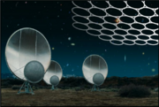
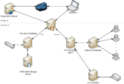
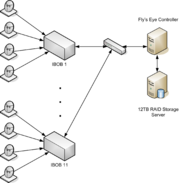
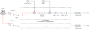
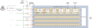
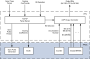
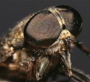

# ATA "Fly's Eye" Pulse Finder

## People ##
* Griffin Foster
* Peter McMahon
* Andrew Siemion
* Joeri van Leeuwen
* Geoff Bower
* Dan Werthimer

## Experiment and Instrumentation ##

The ATA Fly's Eye experiment, aka FindPulse, uses the 42 currently-installed dishes at ATA to search for radio transients. The experiment began December 20, 2007.  In the nominal configuration, the experiment points each of the 42 dishes in different directions to cover a total of 150 square degrees on the sky (at L-band).

The instrumentation consists of 11 IBOBs, which each behave as 4 independent spectrometers, each of which individually processes a 209.5 MHz band over 128 spectral channels with a 0.6 ms integration time.  The experiment is currently operating in L-band, although this may change via the ATA tunable IF.  The design is similar to the [Pocket Correlator](Pocket_correlator.md); the most important difference is that the calculation of cross-terms between the 4 inputs has been removed.

Readout is done via the 100MbE port on each IBOB. The CAT cables are connected to a 1GbE switch, which is connected to a data storage server. Data is sent using UDP at a rate of approximately 7Mbit/sec per IBOB, yielding an aggregate data rate of ~77Mbit/sec.

Data are then dedispersed and searched for pulses on a compute node.

## Deployment ##

The Fly's Eye hardware was deployed at Hat Creek/ATA over 19 and 20 December 2007. Basic data recording and control facilities are in place, and the system has passed several sanity checks including detection of a transmitted chirp pulse. [list of antenna-to-IBOB connections](ATA_antenna_connections.md) and [notes on the computer installs](flyeye_node.md).

## Results ##
[Internal Fly's Eye Results Page](https://casper.ssl.berkeley.edu/wiki/Internal_Fly%27s_Eye_Results_Page)
[FE Satellite Detection](https://casper.ssl.berkeley.edu/wiki/FE_Satellite_Detection)

## Operation Instructions ##

A set of [instructions](ATA_operation_instructions.md) for operating the Fly's Eye experiment at ATA has been compiled.

## People ##

Geoff Bower (UCB Astronomy), Griffin Foster (CASPER), Peter McMahon (CASPER, KAT), Andrew Siemion (CASPER), Joeri van Leeuwen (UCB Astronomy, CASPER), Mark Wagner, Dan Werthimer (UCB SSL, CASPER)

With Advice and Assistance From:

Don Backer (UCB Astronomy, RAL, CASPER), Colby Craybill (RAL), Matt Dexter (RAL, CASPER), David McMahon (RAL, CASPER), Mel Wright (UCB Astronomy, RAL, CASPER)

The idea for this experiment was suggested by Jim Cordes (Cornell)

## Documentation ##

Andrew Siemion. ["The Fly's Eye: Instrumentation for Detection of Radio Ephemeron"](https://www.researchgate.net/publication/266473154_The_Fly's_Eye_Instrumentation_for_Detection_of_Radio_Ephemeron_The_Fly's_Eye_Team) AB Undergraduate Honors Thesis, Department of Astronomy, University of California, Berkeley. Jan 2008.

Peter McMahon. ["Adventures in Radio Astronomy Instrumentation and Signal Processing"](https://arxiv.org/abs/1109.0416) M.Sc. Thesis, Department of Electrical Engineering, University of Cape Town. July 2008. ''Chapter 3 -- The Fly's Eye: Instrumentation for the Detection of Millisecond Radio Pulses''

The Fly's Eye and SETI Teams. ["New SETI Sky Surveys for Radio Pulses"](http://arxiv.org/abs/0811.3046) arXiv preprint. November 2008.

## Data ##

Some of the Fly's Eye Data can be downloaded [here](https://casper.ssl.berkeley.edu/wiki/FE_Data).

## Images

