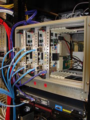

# BAPP

The **Berkeley ATA Pulsar Processor** (BAPP) was deployed by Peter McMahon and Joeri van Leeuwen to the Allen Telescope Array in March 2008, and had first light in April. The BAPP centrepiece is a 104MHz dual polarization, 2048-channel, fast-readout spectrometer that has a direct digital connection to the ATA beamformer. It is intended for incoherent dedispersion-based pulsar studies.

BAPP was developed as part of the [Pulsar Machine Development At Berkeley](pulsar_machine_development.md) CASPER program. Engineering was done by Peter McMahon, with advice and supervision from Don Backer, Joeri van Leeuwen and Dan Werthimer. Joeri is currently overseeing the science operations of BAPP.

### Current Status ###

April 2008: BAPP currently receives a single beam, dual polarization, from the ATA beamformer. There are plans to expand the beamformer to output more beams - once this has been completed, we plan to correspondingly increase the capabilities of BAPP to handle more beams, with the ultimate aim of being able to carry out simultaneous multi-frequency pulsar observations.